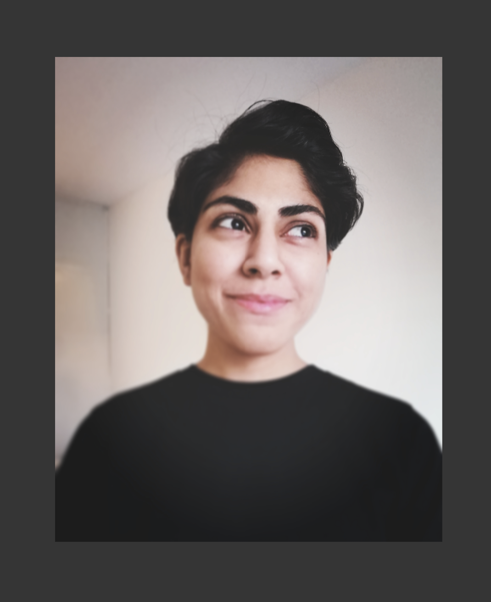

# 🦥 Our Team

|| |
|:---:|:---:|
| **Dr. Sara El-Gebali, Founder** | **Nazeefa Fatima, Co-founder** |
|I am a Research Data Management Team Leader supporting the Scientific Infrastructures unit at the Max Delbrück Center for Molecular Medicine \(MDC\). Before joining the MDC, I was a scientific database curator at the European Molecular Biology Laboratories \(EMBL\)-EBI and EMBO. During my time there, I gained comprehensive knowledge in data analysis, metadata extraction and description, data repositories, journal publishing requirements, open science data sharing practices and FAIR data principles. Prior to that, I gained my PhD from the University of Bern,Switzerland where I studied the role of amino acid transporters in colon cancer progression. I am a strong advocate for community building and the promotion of women and underrepresented minorities in STEM fields.| I am a computational biologist based in Sweden. I studied bioinformatics at the Lunds Universitet and, during my studies, I developed skills in data analysis for genomics and transcriptomics research. After completing master's, I worked for the National Genomics Ifrastructure. Besides research, I contribute my time to [RSG-Sweden](https://www.rsg-sweden.iscbsc.org) and the [International Society of Computational Biology](https://www.iscbsc.org). I care about mental health, accessible research, community building, and increasing visibility of people underrepresented in the field of computational biology. Welcome to OpenCIDER :) We are happy to have you join our team! |
|*"If I cannot do great things, I can do small things in a great way"*|*"We are all smart. Distinguish yourself by being kind" - Charles Gordon"*|

